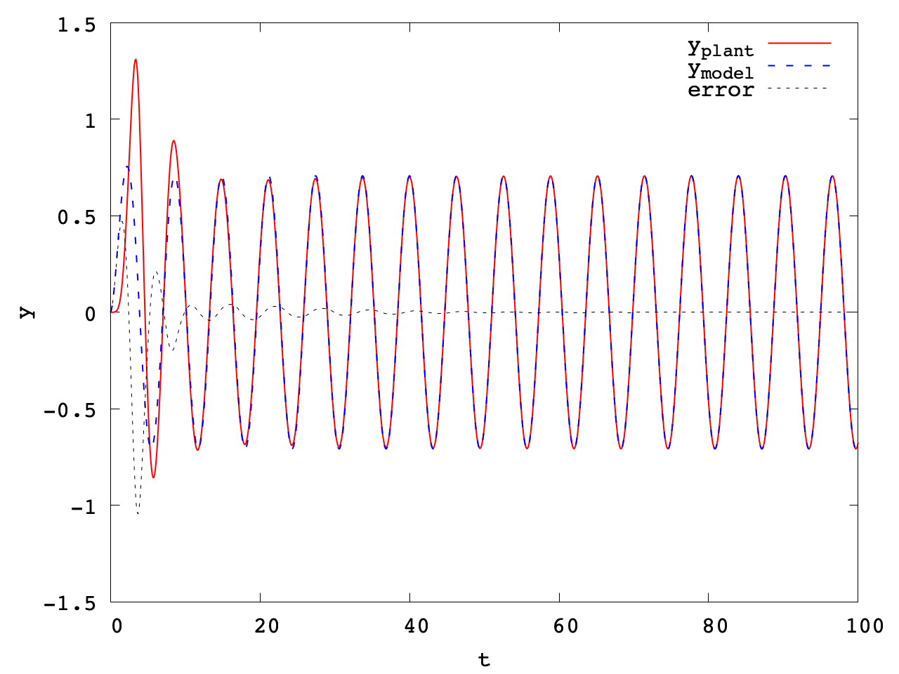
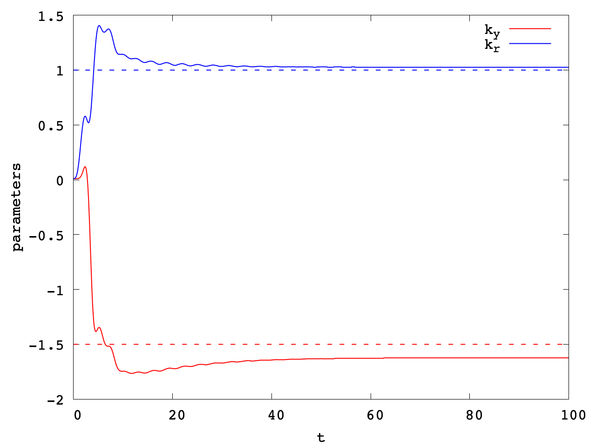
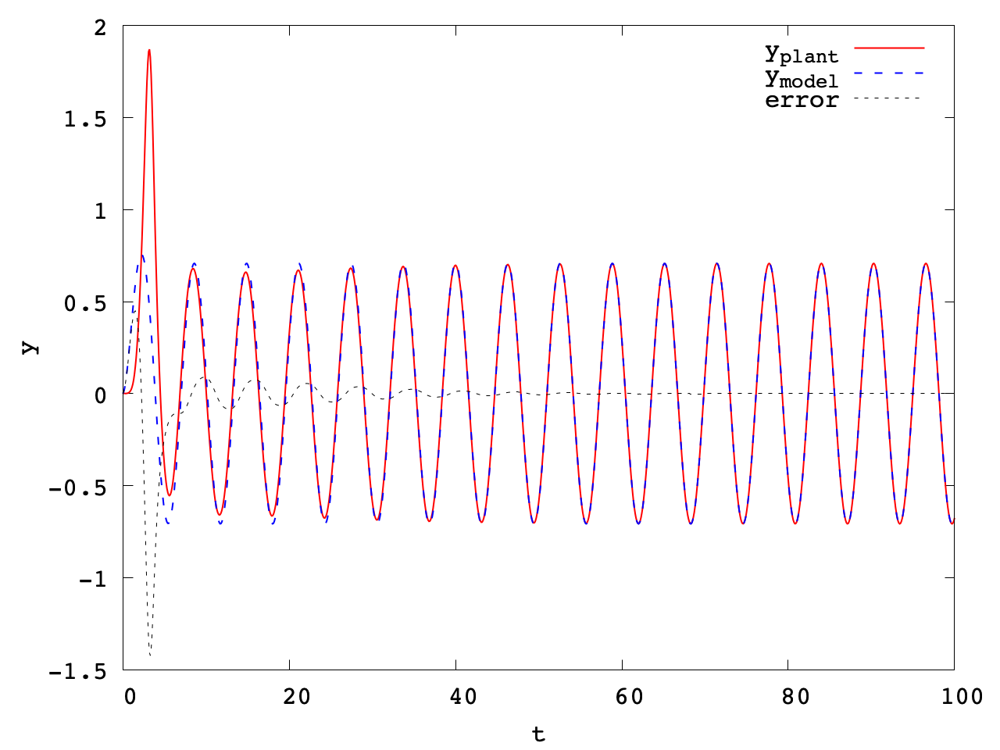
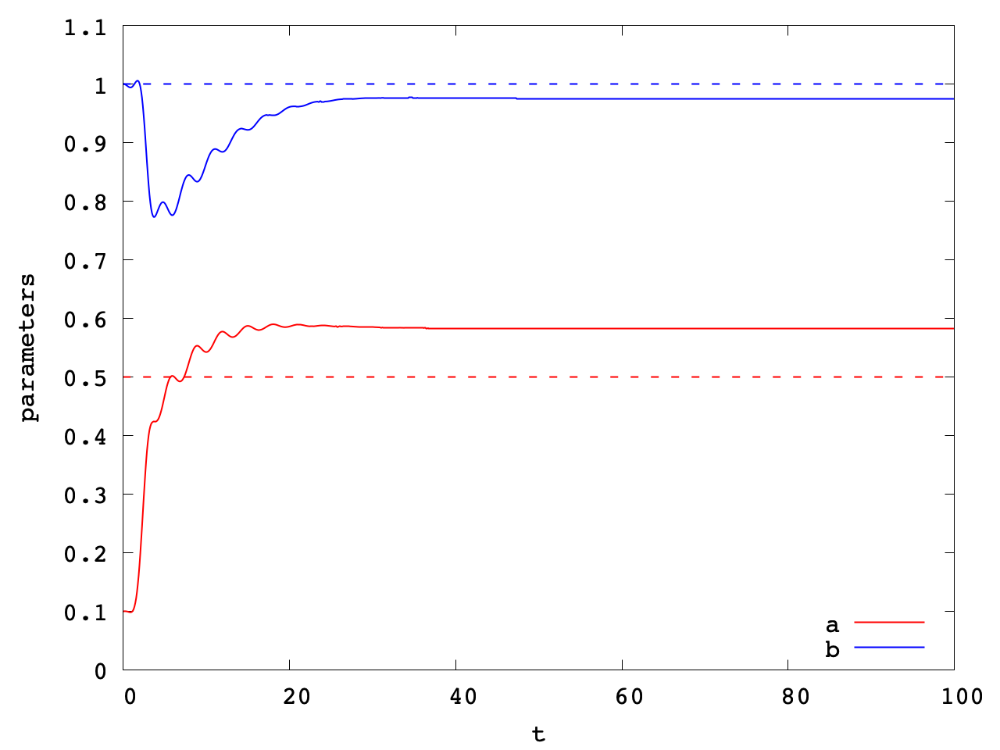
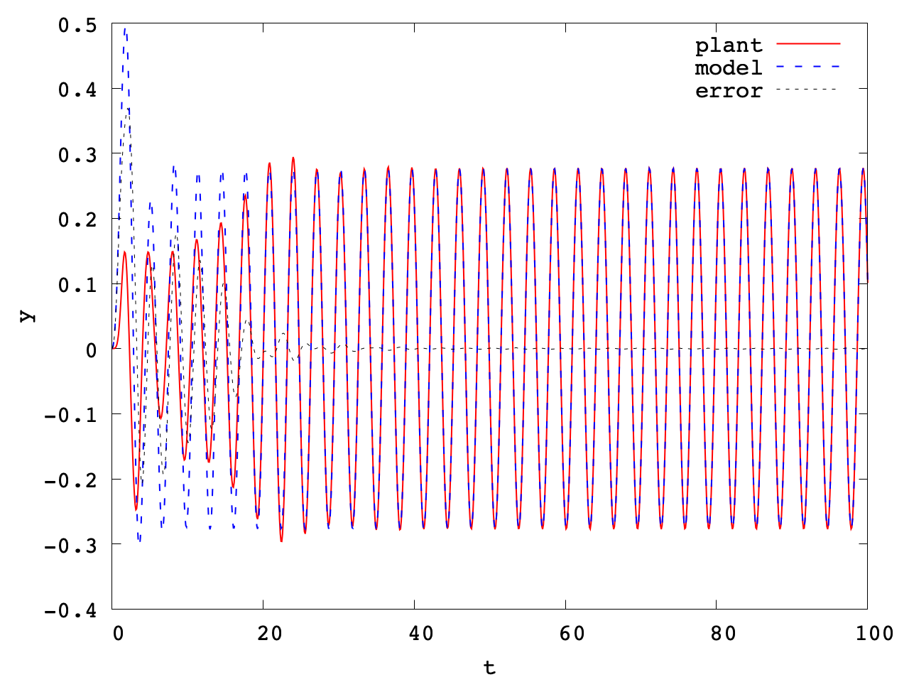
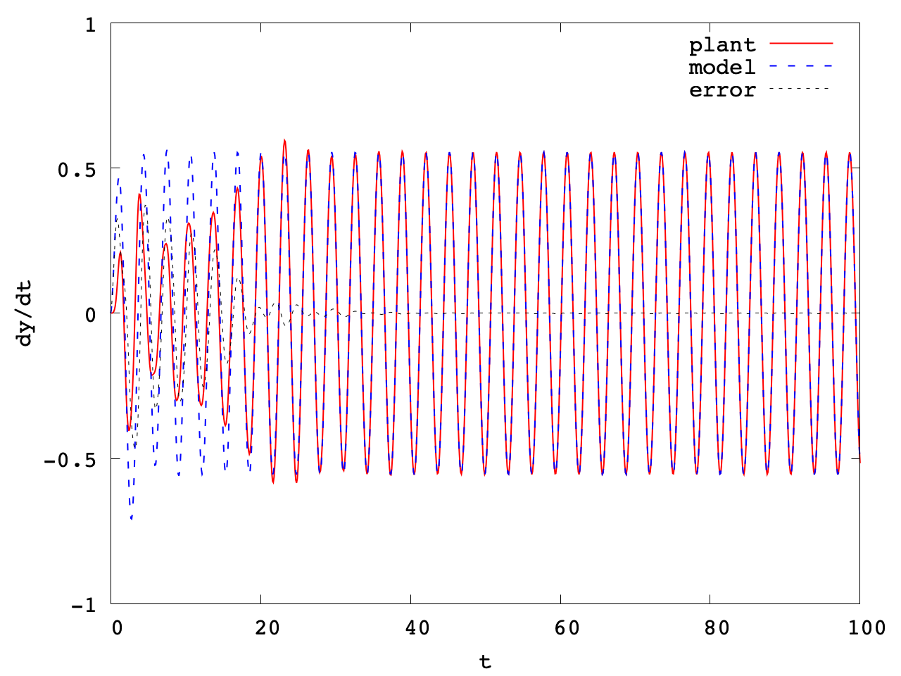
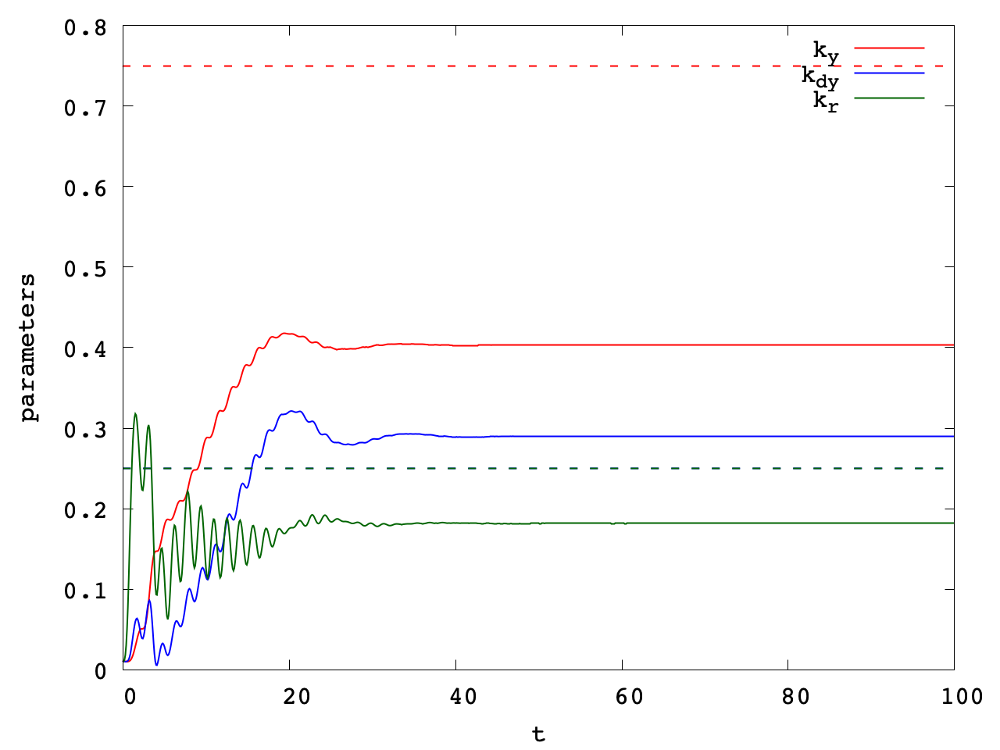

# Adaptive Control

## Model-Reference Adaptive Control (MRAC)

### Direct 1st order SISO

 

### Indirect 1st order SISO

 

### Direct 2nd order SISO

  

## reference

[1] “Model-Reference Adaptive Control A Primer” https://www.springer.com/gp/book/9783319563923

[2] "適応制御 (システム制御工学シリーズ 10)"

[3] "基礎適応制御: 理論,実装,応用"